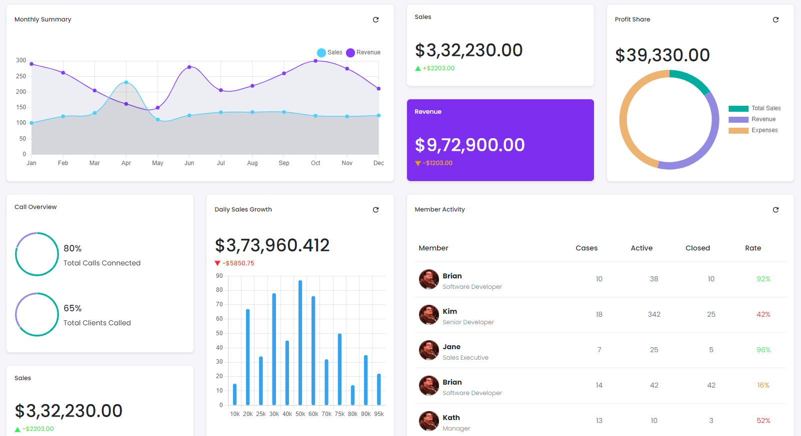

# Tenant Dashboard

This library was generated with [Angular CLI](https://github.com/angular/angular-cli) version 13.2.0.
<p align="left">

<p/>

## ✒️ Code
```bash
<app-rds-comp-tenant-dashboard
  [monthlySummaryDataSets]="monthlySummaryDataSets"
  [monthlySummaryLabels]="monthlySummaryLabels"
  [monthlySummarychartOptions]="monthlySummarychartOptions"
  [pschartDatasets]="pschartDatasets"
  [pschartLabels]="pschartLabels"
  [pschartOptions]="pschartOptions"
  [ClientCallschartDatasets]="ClientCallschartDatasets"
  [ClientCallschartLabels]="ClientCallschartLabels"
  [ClientCallschartOptions]="ClientCallschartOptions"
  [ConnectedCallschartDatasets]="ConnectedCallschartDatasets"
  [ConnectedCallschartLabels]="ConnectedCallschartLabels"
  [ConnectedCallscharOptions]="ConnectedCallschartOptions"
  [barHrChartDatasets]="barHrChartDatasets"
  [barHrChartLabels]="barHrChartLabels"
  [barHrChartOptions]="barHrChartOptions"
  [memberActivityTableHeader]="memberActivityTableHeader"
  [memberActivityTableData]="memberActivityTableData"
></app-rds-comp-tenant-dashboard>
```

## Options
### 🏗️ Input
<!-- prettier-ignore -->
| Input Name                  | Type                             |Example| Description                                                                  |
| --------------------------- | -------------------------------- |------------| ---------------------------------------------------------------------------- |
| SalesPrice               | `string`     |`3,32,230.00`   |Specify the  Sales Price
| SalesProfit                | `string`     |`2203.00`   |Specify the  Sales Profit
| RevenuePrice                | `string`     |`9,72,900.00`   |Specify the   Revenue Price
| RevenueProfit                | `string`     |`1203.00`   |Specify the Revenue Profit
| ProfitSharePrice                | `string`     |`39,330.00`   |Specify the  Profit Share Price
| DailySalesGrowth                | `string`     |`3,73,960.412`   |Specify the  Daily Sales Growth
| SalesGrowthLoss                | `string`     |`5850.75`   |Specify the  Sales Growth Loss
| TotalClientCalls                | `string`     |`75`   |Specify the  Total Client Calls
| TotalConnectedCalls               | `string`     |`93`   |Specify the  Total Connected Calls
| ConnectedCallsData               | `[]`                           |`[80, 100 - 80]`   |Specify the Connected Calls data
| ClientCallsData              | `[]`                           |`[65, 100 - 65]`   |Specify the client calls data
| ProfitShareData                | `[]`                           |`[10, 25, 30]`   |Specify the ProfitShare data
| monthlySummaryDataSets                | `[]`    |`[    {      label: 'Sales',     data: [101, 122, 133, 231, 112, 125, 135, 135.7, 136, 124, 122, 125],      borderColor: '#4DCFFF',      pointBackgroundColor: '#4DCFFF',  fill: true,      pointRadius: 3,      fillColor: "rgba(195, 40, 96, 0.1)",       tension: 0.4,    },    {      label: 'Revenue',      data: [290, 262, 205, 162, 150, 280, 206, 220, 260, 300, 275, 211],      borderColor: '#863BFF',      pointBackgroundColor: '#863BFF',      backgroundColor: '#ECEEF4',      fill: true,      pointRadius: 3,      tension: 0.4,    }  ]`   |Specify the monthly summary chart dataset
| monthlySummaryLabels               | `[]`    |<pre>['Jan', 'Feb', 'Mar', 'Apr', 'May', 'Jun', 'Jul', 'Aug', 'Sep', 'Oct', 'Nov', 'Dec']</pre>  |Specify the monthly summary chart labels
| monthlySummarychartOptions                | `[]`    |<pre>[{  radius: 0,  pointStyle: 'circle', responsive: true,  borderWidth:1.5,  maintainAspectRatio: false,   plugins: { title: {       display: false,      },      legend: { position: 'top', align: "end", pointStyle: "circle",labels: { usePointStyle: true},},<br>tooltip: { enabled: true }}, scales:{ y: { beginAtZero:true, },}, <br>tooltip: { display: true, usePointStyle: true,},}]</pre>  |Specify the monthly summary chart options
| pschartDatasets                | `[]`       |<pre>[{ label: 'Dataset 1',  data: this.ProfitShareData,  backgroundColor: [ '#ff6384',  '#ffcd56', '#4bc0c0' ], <br>fillStyle: 'blue', fillRect: [200, 100, 140, 100], borderColor: ['#fff', ],  borderWidth: 0,  cutout: '85%', <br>title: {   text: "Doughnut Chart",  verticalAlign: "center",  dockInsidePlotArea: true },}]</pre>   |Specify the profit share  chart dataset
| pschartLabels                | `[]`     |<pre>['Total Sales', 'Revenue', 'Expenses']</pre>   |Specify the profit share  chart labels
| pschartOptions                | `[]`   |<pre>[{ cutoutPercentage: 75, legend: { display: false }, responsive: true, maintainAspectRatio: false, plugins: { series: {  label: { position: "inside", text: 'total',  display: false } },<br> doughnutlabel: { labels: [{ text: '550', font: { size: 20, weight: 'bold' } }, { text: 'total' }  ] },<br> legend: { display: true, align: "middle", position: 'right', }, }}]</pre> |Specify the profit share  chart options
| barHrChartDatasets                | `[]`    |<pre>[{ label: 'Sales Growth',  data: [15, 67, 34, 78, 45, 87, 76, 32, 50, 14, 35, 22],  backgroundColor: 'rgba(54, 162, 235, 1)', <br>borderColor: 'rgba(54, 162, 245, 1)', borderWidth: 1, borderRadius: 10,barThickness : 7,  borderSkipped: false, }]</pre>  |Specify the bar chart dataset
| barHrChartLabels                | `[]`    |<pre>['10k', '20k','25k', '30k', '40k', '50k', '60k', '70k', '75k', '80k', '90k', '95k']</pre>   |Specify the bar chart labels
| barHrChartOptions                | `[]`     |<pre>{ indexAxis: 'x',  elements: {  bar: { borderWidth: 0, width: 1 } },  responsive: true,  maintainAspectRatio: false,<br> plugins: { legend: { position: '', pointStyle: "line", labels: { usePointStyle: true } }, scales: { y: { beginAtZero:true, }}, <br>tooltip: {  usePointStyle: true,  }, title: { display: false, text: 'Daily Sales Growth' } },}</pre>   |Specify the bar chart options
| ClientCallschartDatasets                | `[]`   |<pre>[{ label: 'Dataset 1', data: this.ClientCallsData, fillStyle: '#D0D7DD', fillRect: [200, 100, 40, 10], <br>backgroundColor: ['#928AE0','#D0D7DD'], borderColor: ['#fff',], borderWidth: 1, cutout: '90%', title: { text: "Doughnut Chart", verticalAlign: "center", dockInsidePlotArea: true },}]</pre>  |Specify the Client class chart dataset
| ClientCallschartLabels          | `[]`     |<pre>['Total Client calls connected', 'Total Client calls disconnected']<pre>|Specify the Client class chart labels
| ClientCallschartOptions       | `[]`     |<pre>{ elements: {center: { text: '50%' }}, cutoutPercentage: 75, legend: { display: false },responsive: true, maintainAspectRatio: false, <br>plugins: { series: { label: { position: "inside", text: 'total',   display: true } }, <br>doughnutlabel: { labels: [{ text: '550', font: {   size: 20,  weight: 'bold' } }, { text: 'total' } ] }, <br>legend: { display: false, align: "start", position: 'right', }, tooltip: { enabled: false }, }, }</pre> |Specify the Client class chart options
| ConnectedCallschartDatasets               | `[]`     |<pre>[{ label: 'Dataset 1',  data: this.ConnectedCallsData, fillStyle: '#D0D7DD', fillRect: [200, 100, 40, 10], <br>backgroundColor: ['#D0D7DD','#E1E1E1'], borderColor: ['#fff',],borderWidth: 1,cutout: '90%',<br>title: {text: "Doughnut Chart", verticalAlign: "center", dockInsidePlotArea: true }, } ]</pre>|Specify the connected calls chart dataset
| ConnectedCallschartLabels                | `[]`    |<pre>['Total Connected calls', 'Total calls']</pre>   |Specify the connected calls labels
| ConnectedCallschartOptions                | `[]`    |<pre>[{elements: { center: {text: '50%'} },cutoutPercentage: 75,legend: {display: false}, maintainAspectRatio: false, <br>responsive: true, plugins: { series: { label: { position: "inside", text: 'total', display: false }}, doughnutlabel: { labels: [{ text: '550',<br> font: { size: 20, weight: 'bold' }}, {text: 'total' } ]},<br> legend: { display: false, align: "start", position: 'right', }, tooltip: { enabled: false }, } }] </pre>   |Specify the connected calls options
| memberActivityTableHeader                | `[]`    |<pre>[ { 'displayName': 'Member', key: 'member', dataType: 'html' },<br>{ displayName: 'Cases', key: 'cases', dataType: 'html' }, <br> { displayName: 'Active', key: 'active', dataType: 'html' },<br>{ displayName: 'Closed', key: 'closed', dataType: 'html' }, <br>{ displayName: 'Rate', key: 'rate', dataType: 'html' } ]</pre>   |Specify the memeber activity table headers
| memberActivityTableData               | `[]`  |<pre>[ { 'cases': "<div class=\"d-flex align-items-center justify-content-center\"><div> 10 </div></div>", "member": "<div class=\"d-flex align-items-center\"><div> </div><br><div class=\"ms-2 mt-2\"><p class=\"mb-0\"><b>Brian</b></p><small class=\"text-muted\">Software Developer </small></div></div>", "active": "<br><div class=\"d-flex align-items-center justify-content-center\"><div> 38 </div></div>", "closed": "<br><div class=\"d-flex align-items-center justify-content-center\"><div> 10 </div></div>", "rate": "<br><div class=\"HighRate d-flex align-items-center justify-content-center\">92%</div>" }, <br>{ "cases": "<div class=\"d-flex align-items-center justify-content-center\"><div> 18 </div></div>", "member": "<br><div class=\"d-flex align-items-center\"><div> </div><div class=\"ms-2 mt-2\"><br><p class=\"mb-0\"><b>Kim</b></p><small class=\"text-muted\">Senior Developer </small></div></div>", "active": "<br><div class=\"d-flex align-items-center justify-content-center\"><div> 342 </div></div>", "closed": "<div class=\"d-flex align-items-center justify-content-center\"><br><div> 25 </div></div>", "rate": "<div class=\"MidRate d-flex align-items-center justify-content-center\">42%</div>" }    , <br>{ "cases": "<div class=\"d-flex align-items-center justify-content-center\"><div> 7 </div></div>", "member": "<br><div class=\"d-flex align-items-center\"><div> </div><br><div class=\"ms-2 mt-2\"><p class=\"mb-0\"><b>Jane</b></p><small class=\"text-muted\">Sales Executive </small></div></div>", "active": "<br><div class=\"d-flex align-items-center justify-content-center\"><div> 25 </div></div>", "closed": "<br><div class=\"d-flex align-items-center justify-content-center\"><div> 5 </div></div>", "rate": "<div class=\"HighRate d-flex align-items-center justify-content-center\">96%</div>" }    ,<br> { "cases": "<div class=\"d-flex align-items-center justify-content-center\"><div> 14 </div></div>", "member": "<div class=\"d-flex align-items-center\"><br><div> </div><div class=\"ms-2 mt-2\"><p class=\"mb-0\"><b>Brian</b></p><br><small class=\"text-muted\">Software Developer</small></div></div>", "active": "<div class=\"d-flex align-items-center justify-content-center\"><div> 42 </div></div>", "closed": "<br><div class=\"d-flex align-items-center justify-content-center\"><div> 42 </div></div>", "rate": "<div class=\"LowRate d-flex align-items-center justify-content-center\">16%</div>" }    ,<br> { "cases": "<div class=\"d-flex align-items-center justify-content-center\"><div> 13 </div></div>", "member": "<div class=\"d-flex align-items-center\"><br><div> </div><div class=\"ms-2 mt-2\"><p class=\"mb-0\"><b>Kath</b></p><br><small class=\"text-muted\">Manager </small></div></div>", "active": "<div class=\"d-flex align-items-center justify-content-center\"><div> 10 </div></div>", "closed": "<br><div class=\"d-flex align-items-center justify-content-center\"><div> 3 </div></div>", "rate": "<div class=\"MidRate d-flex align-items-center justify-content-center\">52%</div>" }  ]`   |Specify the memeber activity table data


