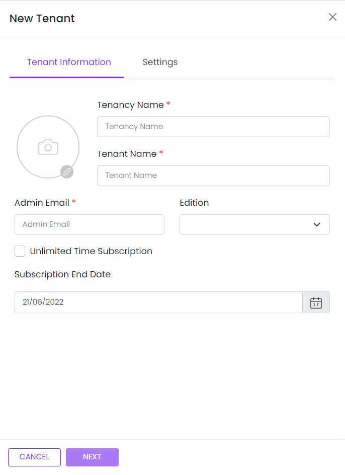

# Tenant Information

This library was generated with [Angular CLI](https://github.com/angular/angular-cli) version 13.2.0.

<p align="left">
"
<p/>

## Code


``` bash 
    <app-rds-comp-tenant-information (tenantInfo)="getTenantData($event)" [editionList]="editionList"
                    [tenantData]="tenantData" (onCancel)="close()" [showEmail]="showEmailList">
    </app-rds-comp-tenant-information>
```

## Options
### Input
<!-- prettier-ignore -->
| Input Name                  | Type                             |Example| Description                                                                  |
| --------------------------- | -------------------------------- |------------| ---------------------------------------------------------------------------- |
| `editionList`               | `array of object`                          | `[{"isFree":null,"value":"","displayText":"Not assigned","isSelected":true},{"isFree":true,"value":"1","displayText":"Standard","isSelected":false},{"isFree":false,"value":"5","displayText":"apple","isSelected":false},{"isFree":false,"value":"6","displayText":"Apple1","isSelected":false}]`|Edition dropdown list Data|
| `tenantData`                |  `object`                       | `{"adminEmailAddress":"don.j@gmail.com","edition":"1","subscriptionEndDate":"Wed Jun 22 2022 15:16:43 GMT+0530","tenancyName":"don","tenantName":"don j","unlimitedSubscription":"true"}`|Object of the new tenant|


### Output
| Output Name                 | Type          | Description                     |      
| --------------------------- | --------------|------------------|
| `tenantInfo`                 |  `EventEmitter`  | `Emit value For saving the tenant Info`  |
| `onCancel`                 |  `EventEmitter`  | `Emit any value at the time of cancel click`  |
