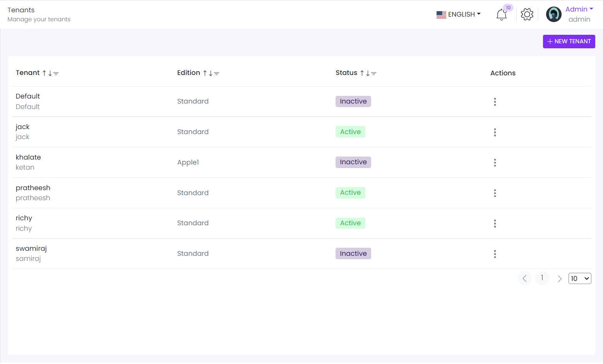

# Tenant List

This library was generated with [Angular CLI](https://github.com/angular/angular-cli) version 13.2.0.

<p align="left">

<p/>

## Code

``` bash 
  rdsTenantMfeConfig: ComponentLoaderOptions = {
    name: 'RdsCompTenantList'
  };
   this.rdsTenantMfeConfig = {
      name: 'RdsCompTenantList',
      input: {
        tenantHeaders: this.tenantTableHeader,
        tenantList: this.tenantTableData,
        editionList: this.editionList,
        noDataTitle: 'Currently you do not have tenant'
      },
      output: {
        onSaveTenant: (tenant: any) => {
          if (tenant && tenant.tenantInfo) {
            if (tenant.tenantInfo.id) {
              const data: any = {
                tenancyName: tenant.tenantInfo.tenancyName,
                name: tenant.tenantInfo.tenantName,
                connectionString: tenant.tenantSettings.connectionString,
                editionId: +tenant.tenantInfo.edition,
                isActive: tenant.tenantSettings.isActive,
                subscriptionEndDateUtc: new Date(tenant.tenantInfo.subscriptionEndDate).toISOString(),
                isInTrialPeriod: false,
                id: tenant.tenantInfo.id
              };
              this.store.dispatch(updateTenant(data))

            } else {
              const data: any = {
                tenancyName: tenant.tenantInfo.tenancyName,
                name: tenant.tenantInfo.tenantName,
                adminEmailAddress: tenant.tenantInfo.adminEmailAddress,
                adminPassword: tenant.tenantSettings.password,
                connectionString: tenant.tenantSettings.connectionString,
                shouldChangePasswordOnNextLogin: tenant.tenantSettings.changePasswordOnNextLogin,
                sendActivationEmail: tenant.tenantSettings.sendActivationEmail,
                editionId: +tenant.tenantInfo.edition,
                isActive: tenant.tenantInfo.isActive,
                subscriptionEndDateUtc: new Date(tenant.tenantInfo.subscriptionEndDate).toISOString(),
                isInTrialPeriod: false
              };
              this.store.dispatch(saveTenant(data))

            }

          }

        },
        onEditTenant: (selectedTenant: any) => {
          this.store.dispatch(getTenantForEdit(selectedTenant));
          this.store.dispatch(getTenantFeaturesForEdit(selectedTenant))
        },
        onReset: (event: any) => {
          this.tenantData = undefined;
          this.tenantSettingsInfo = undefined;
          this.tenantFeatureValues = [];
          this.tenantFeatures = [];
          const mfeConfig = this.rdsTenantMfeConfig
          mfeConfig.input.tenantData = { ... this.tenantData };
          mfeConfig.input.tenantSettingsInfo = { ... this.tenantSettingsInfo };
          mfeConfig.input.tenantFeatureValues = [... this.tenantFeatureValues];
          mfeConfig.input.tenantFeatures = [... this.tenantFeatures];
          this.rdsTenantMfeConfig = mfeConfig;
        },
        deleteEvent: (event: any) => {
          this.store.dispatch(deleteTenant(event.id))
        },
        onSaveFeatures: (feature: any) => {
          this.store.dispatch(updateTenantFeatureValues(feature))
        }
      }
    };
<mfe-loader [config]="rdsTenantMfeConfig"></mfe-loader>
  ```

## Options
### Input
<!-- prettier-ignore -->
| Input Name                  | Type                             |Example| Description                                                                  |
| --------------------------- | -------------------------------- |------------| ---------------------------------------------------------------------------- |
| `tenantList`             | `array list`        |`[{"tenantInfoTemplate":"<div class=\"\"><div><div><span>Default</span></div><span class=\"text-muted\">Default </span></div></div>","statusTemplate":"<div><span class=\"badge badge-secondary\">Inactive</span></div>","editionDisplayName":"Standard","editionTemplate":"<div class=\"d-flex align-items-center\"><div class=…tandard\"></div><div class=\"\">Standard</div></div>","id":1},{"tenantInfoTemplate":"<div class=\"\"><div><div><span>jack</span></div><span class=\"text-muted\">jack </span></div></div>","statusTemplate":"<div> <span class=\"badge badge-success\">Active</span></div>","editionDisplayName":"Standard","editionTemplate":"<div class=\"d-flex align-items-center\"><div class=…tandard\"></div><div class=\"\">Standard</div></div>","id":4}`|List of object of the tenant`
| `editionList`               | `array of object`                          | `[{"isFree":null,"value":"","displayText":"Not assigned","isSelected":true},{"isFree":true,"value":"1","displayText":"Standard","isSelected":false},{"isFree":false,"value":"5","displayText":"apple","isSelected":false},{"isFree":false,"value":"6","displayText":"Apple1","isSelected":false}]`|Edition dropdown list Data|
| `tenantHeaders`                |  `array of object`                       | `[{"displayName":"Tenant","key":"tenantInfoTemplate","dataType":"html","dataLength":30,"sortable":true,"required":true,"filterable":true},{"displayName":"Edition","key":"editionTemplate","dataType":"html","dataLength":30,"sortable":true,"required":true,"filterable":true},{"displayName":"Status","key":"statusTemplate","dataType":"html","dataLength":30,"sortable":true,"required":true,"filterable":true}]`|Specify headers of the tenant list|
| `tenantData`                |  `object`                       | `{"adminEmailAddress":"don.j@gmail.com","edition":"1","subscriptionEndDate":"Wed Jun 22 2022 15:16:43 GMT+0530","tenancyName":"don","tenantName":"don j","unlimitedSubscription":"true"}`|Object of the new tenant|
| `noDataTitle`                |  `string`                       | ""|Specify No data title of the tenant list|
| `tenantSettingsInfo`                |  `object`                       | `{"confirmPassword":"12345","password":"12345"}`|Specify the style of the chart|
|`tenantFeatureValues`|`array of objects`|`[{"name":"App.MaxUserCount","value":"0"},{"name":"TestEditionScopeFeature","value":"false"},{"name":"App.TestCheckFeature","value":"false"},{"name":"App.TestCheckFeature2","value":"true"},{"name":"App.ChatFeature","value":"false"},{"name":"App.ChatFeature.TenantToTenant","value":"false"},{"name":"App.ChatFeature.TenantToHost","value":"false"}]`|Selected Feature list in the tenent|
|`tenantFeatures`|`array of object`|`[{"data":{"parentName":null,"name":"TestEditionScopeFeature","displayName":"[Test edition scope feature]","description":null,"defaultValue":"false","inputType":{"name":"CHECKBOX","attributes":{},"validator":{"name":"BOOLEAN","attributes":{}}}},"level":1,"selected":false,"label":"[Test edition scope feature]","expandedIcon":"fa fa-folder-open text-warning","collapsedIcon":"fa fa-folder text-warning","expanded":true,"selectable":true,"children":[]}]`|Feature list for create the tree|

### Output
| Output Name                 | Type          | Description                     |      
| --------------------------- | --------------|------------------|
| `onSaveTenant`                 |  `EventEmitter`  | `Emit value For saving the Tenant`  |
| `onEditTenant`                 |  `EventEmitter`  | `Emit ID of tenant that need to edit`  |
| `deleteEvent`                 |  `EventEmitter`  | `Emit ID of tenent that need to delete`  |
| `onSaveFeatures`                 |  `EventEmitter`  | `Emit value features that need to save`  |


