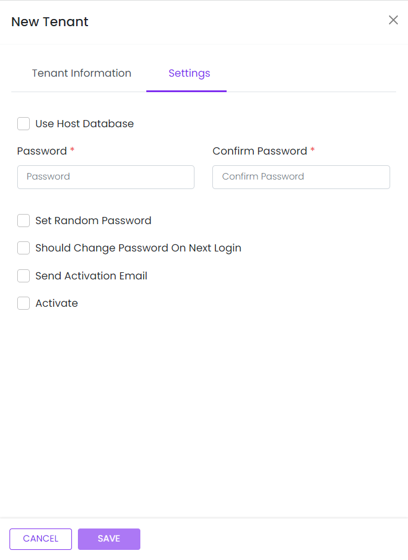

# Tenant Setting

This library was generated with [Angular CLI](https://github.com/angular/angular-cli) version 13.2.0.

<p align="left">

<p/>

## Code


```bash
   <app-rds-comp-tenant-settings (tenantSettings)="getTenantSettings($event)"
                    [isTenantInfoValid]="isTenantInfoValid" [tenantSettingsInfo]="tenantSettingsInfo" [showEditData]="showEditData"
                    (onCancel)="close()">
    </app-rds-comp-tenant-settings>
```

## Options
### Input
<!-- prettier-ignore -->
| Input Name                  | Type                             |Example| Description                                                                  |
| --------------------------- | -------------------------------- |------------| ---------------------------------------------------------------------------- |
| `tenantSettingsInfo`                |  `object`                       | `{"confirmPassword":"12345","password":"12345"}`|"Object for save and edit the tenant setting"|
| `isTenantInfoValid`               | `boolean`                          | "false"|For enable and desable the Save button|
| `showEditData`                |  `boolean`                       | "false"|"For show and hide the Setting page"|

### Output
| Output Name                 | Type          | Description                     |      
| --------------------------- | --------------|------------------|
| `tenantSettings`                 |  `EventEmitter`  | `Emit value For saving the Tenant srtting`  |
| `onCancel`                 |  `EventEmitter`  | `Emit any value at cancel click`  |

