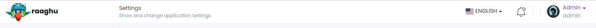

# Top Navigation

This library was generated with [Angular CLI](https://github.com/angular/angular-cli) version 13.2.0.
<p align="left">

<p/>

## ✒️ Code
```bash
<app-rds-top-navigation
  [userList]="userList"
  [rdsDeligateTableHeader]="rdsDeligateTableHeader"
  [rdsDeligateTableData]="rdsDeligateTableData"
  [linkedAccount]="linkedAccount"
  [LoginAttempts]="LoginAttempts"
  [ProfileData]="ProfileData"
  [languageItems]="languageItems"
  [selectedLanguage]="selectedLanguage"
  [recordsPerpage]="recordsPerpage"
  [pagination]="pagination"
  [Profileurl]="Profileurl"
></app-rds-top-navigation>
```
## Options
### 🏗️ Input
<!-- prettier-ignore -->
| Input Name                  | Type        |Example     | Description                                                                  |
| --------------------------- | ----------- |------------| ---------------------------------------------------------------------------- |
| userList              | `any`       | <pre>[{ some: 'Niphy', userId: 1 }, { userId: 2, some: 'Anupriya' },<br> { some: 'Pratheesh', userId: 3 }, { userId: 4, some: 'shreekanth' }]</pre>  |    Specify the list of users |
|rdsDeligateTableHeader |`any`    |<pre>[{ displayName: 'User name', dataLength: 30, dataType: 'text', sortable: true, key: 'username', required: false },<br>{ displayName: 'Start time', dataType: 'date', sortable: false, key: 'starttime' }, <br>{ displayName: 'End time', dataType: 'date', sortable: false, key: 'endtime' }]</pre>|  Specify user delegation table header items|
| rdsDeligateTableData       | `any`       | ``  |    Specify the list of user delegate data |
|linkedAccount   |`any` |<pre>[{ TableHeader: [{ displayName: 'User Name', key: 'username', dataType: 'text', dataLength: 30, required: true }],tableData: [] }]`</pre>|     Specify linked account data  |
|languageItems    |`any` |<pre>[{creationTime: '2022-06-16T09:39:28.572322',creatorUserId: nulldeleterUserId: null,deletionTime: null,displayName: 'Deutsch',icon: 'famfamfam-flags de',<br>id: 16,isDeleted: false,isDisabled: false,lastModificationTime: null,lastModifierUserId: null,name: 'de',tenantId: null}]</pre>|     Specify language list  |
|selectedLanguage    |`any` |<pre>{ language: '', icon: '' }</pre>|     Specify selected language data data  |
|defaultLanguage    |`any` |"en"|     Specify default language  |
|LoginAttempts    |`any` |<pre>[{ TableHeader: [ { displayName: 'IP Address', key: 'clientIpAddress', dataType: 'text', dataLength: 30, required: true },<br>{ displayName: 'Client', key: 'clientName', dataType: 'text', dataLength: 30, required: true },<br>{ displayName: 'Browser', key: 'browserInfo', dataType: 'text', dataLength: 30, required: true },<br>{ displayName: 'Date&Time', key: 'creationTime', dataType: 'text', dataLength: 30, required: true },<br>{ displayName: 'Result', key: 'result', dataType: 'text', dataLength: 30, required: true }],LoginDatatable: [] }]</pre>|     Specify linked account data  |
|ProfileData | `any`  |<pre>[{emailAddress: "admin@aspnetzero.com",isGoogleAuthenticatorEnabled: false,isPhoneNumberConfirmed: false,name: "admin",phoneNumber: null,qrCodeSetupImageUrl: "",surname: "admin",timezone: null,userName: "admin"}]</pre>    |   Specify profile data
|Profileurl|  `string`|"https://th.bing.com/th/id/OIP.3IsXMskZyheEWqtE3Dr7JwHaGe?pid=ImgDet&rs=1"| Specify the profile url
|MenuItems| `[]`  |<pre>[ { label: 'Manage Linked Accounts', translationKey: 'Manage Linked Accounts', tablink: '#nav-LinkAccount', ariacontrols: 'nav-LinkAccount', <br>Image: 'bi bi-pencil-fill', icon: 'manage_linked_accounts', subText: 'Manage accounts linked to your account', subtextTranslationKey: 'Manage accounts linked to your account' }, <br>{ label: 'Manage Authority Delegation', translationKey: 'Manage Authority Delegation', tablink: '#nav-Deligation', ariacontrols: 'nav-Deligation',<br>icon: 'manage_authority_delegations', subText: 'Manage authority accounts', subtextTranslationKey: 'Manage authority accounts' },<br>{ label: 'Login Attempts', translationKey: 'Login Attempts', tablink: '#nav-Attempts', ariacontrols: 'nav-Attempts',<br> icon: 'login_attempts', subText: 'See recent login attempts for your account', subtextTranslationKey: 'See recent login attempts for your account' },<br> { label: 'My Settings', translationKey: 'My Settings', tablink: '#nav-Settings', ariacontrols: 'nav-Settings',<br> icon: 'my_settings', subText: 'Change your account settings', subtextTranslationKey: 'Change your account settings', },<br>{ label: 'Download Collected Data', translationKey: 'Download Collected Data', tablink: '#nav-DownLoad',<br> ariacontrols: 'nav-DownLoad', icon: 'download_collected_data', subText: 'Download data belongs to your account', subtextTranslationKey: 'Download data belongs to your account' }, ]</pre>    |  Specify the menu items in profile side bar
|recordsPerpage|`number`    | 10  |Specify number of records per page|
|pagination| `boolean`| false | specify pagination required or not
|tableStyle|  `string`| `light`| Specify the color for table
|tableWidth|  `string`| "100%"| Specify the width of table
|profilePic|  `string`| `https://th.bing.com/th/id/OIP.3IsXMskZyheEWqtE3Dr7JwHaGe?pid=ImgDet&rs=1` | Specify the profile picture
|logo|  `string`| ""| Specify the logo
|tableWidth|  `string`| "100%"| Specify the width of table

### 💻 Output
| Output Name                 | Type                 | Description                                                                  |
| --------------------------- | ---------------------|---------------------------------------------------------------------- |
| ondeleteLinkaccount         | `EventEmitter`       |    Emits the event on delete linked account  |
| onLinkToUser                | `EventEmitter`       |    Emits the event on link to user  |
| onSaveDelegate              | `EventEmitter`       |    Emits the event on save user delegates  |
| onLanguageSelection         | `EventEmitter`       |    Emits the elanguage name on changing language  |
| onImageupload               | `EventEmitter`       |    Emits the image data on selecting profile image  |
| onLoginAttempts             | `EventEmitter`       |    Emits the event of login attempts  |
| onDownloadLink              | `EventEmitter`       |    Emits the data on clicking down load link  |
|onProfileSave                |`EventEmitter`        |   Emits the event on saving my settings data
