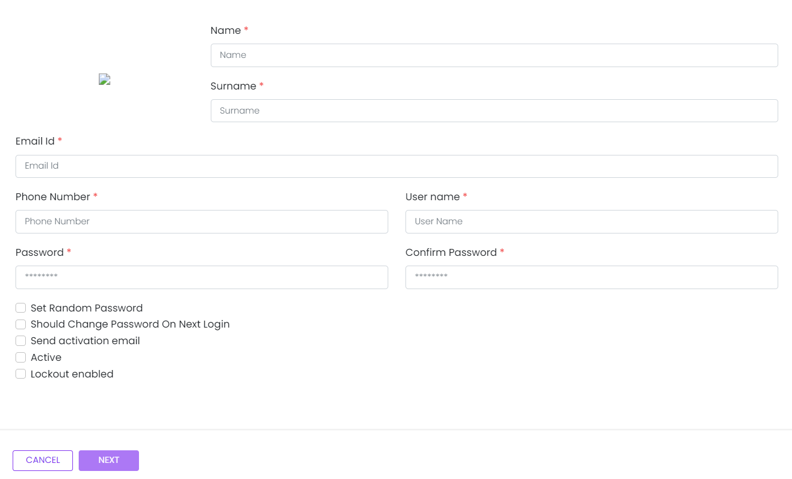

# User Basics

This library was generated with [Angular CLI](https://github.com/angular/angular-cli)
<p align="left">

<p/>

## ✒️ Code
```bash
<app-rds-comp-user-basics [userData]="userData">
<app-rds-comp-user-basics>
```

## Options
### 🏗️ Input
<!-- prettier-ignore -->
| Input Name                  | Type                             |Example| Description                                                                  |
| --------------------------- | -------------------------------- |------------| ---------------------------------------------------------------------------- |
| userData                | `any`                           |<pre>[{"emailAddress": "admin@aspnetzero.com", "id": 1, "isActive": true, "isLockoutEnabled": true,<br>"isTwoFactorEnabled": true, "name": "admin", "password": null, "phoneNumber": null, <br>"shouldChangePasswordOnNextLogin": false, "surname": "admin", "userName": "admin" }]</pre>|Specify the user data  |


### 💻 Output
| Output Name                 | Type          | Description                     |      
| --------------------------- | --------------|------------------|
| onCancel                 |  `EventEmitter`  | `Emits the event on cancel click`
| userInfo                 |  `EventEmitter`  | `Emits the user data for save`
