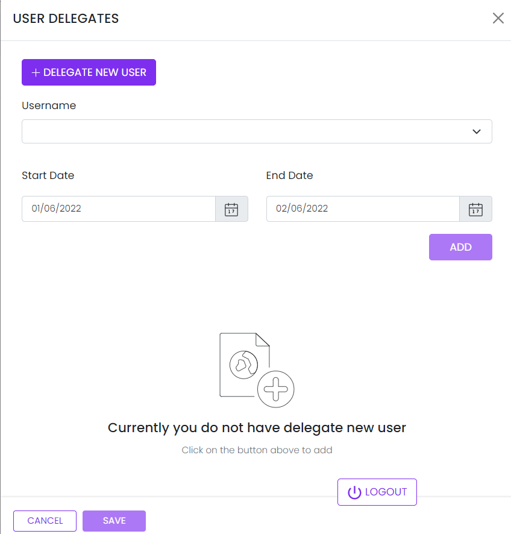

# User Delegations

This library was generated with [Angular CLI](https://github.com/angular/angular-cli) version 13.2.0.
<p align="left">

<p/>

## ✒️ Code
```bash
<app-rds-user-delegations
  [userList]="userList"
  [rdsDeligateTableHeader]="rdsDeligateTableHeader"
  [rdsDeligateTableData]="rdsDeligateTableData"
  [recordsPerpage]="recordsPerpage"
  [pagination]="pagination"
></app-rds-user-delegations>
```

## Options
### 🏗️ Input
<!-- prettier-ignore -->
| Input Name                  | Type                             |Example| Description                                                                  |
| --------------------------- | -------------------------------- |------------| ---------------------------------------------------------------------------- |
| userList                | `[]`   |<pre>[{ some: 'Niphy', userId: 1 }, { userId: 2, some: 'Anupriya' },<br> { some: 'Pratheesh', userId: 3 }, { userId: 4, some: 'shreekanth' }]</pre>  |Specify the language text data 
| rdsDeligateTableHeader                | `[]`   |<pre>[{displayName: 'User name', dataLength: 30, dataType: 'text', sortable: true, key: 'username', required: false },<br>{ displayName: 'Start time', dataType: 'date', sortable: false, key: 'starttime' }, <br>{ displayName: 'End time', dataType: 'date', sortable: false, key: 'endtime' }]</pre>|Specify user delegation table header items|
| rdsDeligateTableData                | `[]`                           |``   |Specify the user Deligate Table data 
| recordsPerpage                | `number`                           |`10`   |Specify the number of records for page
| pagination                | `boolean`                           |`false`   |Specify pagination required or not

### 💻 Output
| Output Name                 | Type          | Description                     |      
| --------------------------- | --------------|------------------|
| onDeligateSave                 |  `EventEmitter`  | `Emits the data for save`
| onCancelDeligate                 |  `EventEmitter`  | `Emits the event on cancel click`
| onDeleteDeligate                 |  `EventEmitter`  | `Emits the id for delete`
