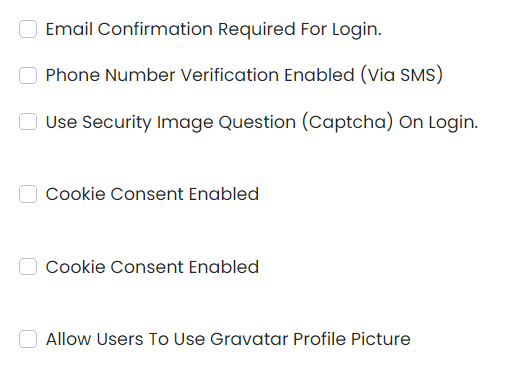

# User Management

This library was generated with [Angular CLI](https://github.com/angular/angular-cli) version 13.2.0.
<p align="left">

<p/>

## ✒️ Code
```bash
  <app-rds-comp-user-management [Usermanagementsettings]="Usermanagementsettings">
  </app-rds-comp-user-management>
```

## Options
### 🏗️ Input 
<!-- prettier-ignore -->
| Input Name                  | Type                             |Example| Description                                                                  |
| --------------------------- | -------------------------------- |------------| ---------------------------------------------------------------------------- |
| Usermanagementsettings               | `any`     |<pre>[{isEmailConfirmationRequiredForLogin: false, useCaptchaOnLogin: false, isCookieConsentEnabled: false,<br> sessionTimeOutSettings: false, allowUsingGravatarProfilePicture: false, smsVerificationEnabled: false} ]</pre>|Specify the user management settings data  |


