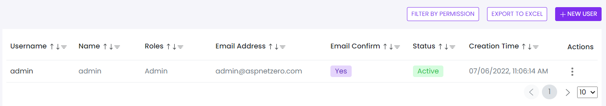

# User Permissions
This library was generated with [Angular CLI](https://github.com/angular/angular-cli) version 13.2.0.
<p align="left">

<p/>

## ✒️ Code
```bash
<app-rds-comp-user-permissions
  [FilterPermissionList]="FilterPermissionList"
  [userHeaders]="userHeaders"
  [userList]="userList"
  [permissionsList]="permissionsList"
  [orgTreeData]="orgTreeData"
  [roles]="roles">
</app-rds-comp-user-permissions>
```

## Options
### 🏗️ Input
<!-- prettier-ignore -->
| Input Name                  | Type                             |Example| Description                                                                  |
| --------------------------- | -------------------------------- |------------| ---------------------------------------------------------------------------- |
| FilterPermissionList                | `[]`  |<pre>[{ "data": { "parentName": null, "name": "TestEditionScopeFeature", "displayName": "[Test edition scope feature]",      "description": null, "defaultValue": "false",<br> "inputType": { "name": "CHECKBOX", "attributes": {}, "validator": { "name": "BOOLEAN", "attributes": {} } } },    "level": 1, "selected": false, <br>"label": "[Test edition scope feature]", "expandedIcon": "fa fa-folder-open text-warning",  "collapsedIcon": "fa fa-folder text-warning", "expanded": true, <br>"selectable": true, "children": []  },  { "data": { "parentName": null, "name": "App.ChatFeature", "displayName": "Chat", "description": null,      <br>"defaultValue": "false", "inputType": { "name": "CHECKBOX", "attributes": {}, "validator": { "name": "BOOLEAN", "attributes": {} } }}, "level": 1, "selected": false, <br>"label": "Chat", "expandedIcon": "fa fa-folder-open text-warning", "collapsedIcon": "fa fa-folder text-warning", "expanded": true, "selectable": true,   <br> "children": [ {  "data": { "parentName": "App.ChatFeature", "name": "App.ChatFeature.TenantToHost", "displayName": "Chat with host", "description": null, <br>"defaultValue": "false",  "inputType": { "name": "CHECKBOX", "attributes": {}, "validator": {  "name": "BOOLEAN", "attributes": {} } }}, "level": 2, <br>"selected": false,"label": "Chat with host", "expandedIcon": "fa fa-folder-open text-warning", "collapsedIcon": "fa fa-folder text-warning", "expanded": true, <br>"selectable": true, "children": [] },{ "data": { "parentName": "App.ChatFeature", "name": "App.ChatFeature.TenantToTenant", "displayName": "Chat with other tenants", <br>"description": null,   "defaultValue": "false", "inputType": {  "name": "CHECKBOX", "attributes": {}, "validator": { "name": "BOOLEAN", "attributes": {} } } }, <br>"level": 2, "selected":false,  "label": "Chat with other tenants", "expandedIcon": "fa fa-folder-open text-warning", "collapsedIcon": "fa fa-folder text-warning", <br>"expanded": true, "selectable": true,  "children": []  } ] }, {  "data": {"parentName": null, "name": "App.MaxUserCount", "displayName": "Maximum user count",   <br>"description": "0 = unlimited",  "defaultValue": "0", "inputType": {"name": "SINGLE_LINE_STRING",  "attributes": {},  "validator": {  "name": "NUMERIC",  <br>"attributes": { "MinValue": 0,  "MaxValue": 2147483647  } }  } },"level": 1, "selected": false, "label": "Maximum user count", "expandedIcon": "fa fa-folder-open text-warning", <br>"collapsedIcon": "fa fa-folder text-warning",  "expanded": true,   "selectable": false, "children": []  },  { "data": { "parentName": null,<br> "name": "App.TestCheckFeature", "displayName": "Test check feature",  "description": null, "defaultValue": "false", "inputType": { "name": "CHECKBOX", <br>"attributes": {}, "validator": { "name": "BOOLEAN", ttributes": {} }}},"level": 1,    "selected": false,    "label": "Test check feature",    "expandedIcon": "fa fa-folder-open text-warning",    <br>"collapsedIcon": "fa fa-folder text-warning",    "expanded": true,    "selectable": true,    "children": []  },  { "data": {"parentName": null,<br>"name": "App.TestCheckFeature2", "displayName": "Test check feature 2",  "description": null,  "defaultValue": "true",      "inputType": { "name": "CHECKBOX", "attributes": {},  <br>"validator": {  "name": "BOOLEAN",  "attributes": {} } }}, "level": 1,  "selected": false,  "label": "Test check feature 2",   "expandedIcon": "fa fa-folder-open text-warning",    <br>"collapsedIcon": "fa fa-folder text-warning",    "expanded": true,    "selectable": true,    "children": []  }]</pre>   |Specify the filter permission list data |
| `permissionsList`                | `[]`  |<pre>[{ "data": { "parentName": null, "name": "TestEditionScopeFeature", "displayName": "[Test edition scope feature]",      "description": null, "defaultValue": "false",<br> "inputType": { "name": "CHECKBOX", "attributes": {}, "validator": { "name": "BOOLEAN", "attributes": {} } } },    "level": 1, "selected": false, <br>"label": "[Test edition scope feature]", "expandedIcon": "fa fa-folder-open text-warning",  "collapsedIcon": "fa fa-folder text-warning", "expanded": true, <br>"selectable": true, "children": []  },  { "data": { "parentName": null, "name": "App.ChatFeature", "displayName": "Chat", "description": null,      <br>"defaultValue": "false", "inputType": { "name": "CHECKBOX", "attributes": {}, "validator": { "name": "BOOLEAN", "attributes": {} } }}, "level": 1, "selected": false, <br>"label": "Chat", "expandedIcon": "fa fa-folder-open text-warning", "collapsedIcon": "fa fa-folder text-warning", "expanded": true, "selectable": true,   <br> "children": [ {  "data": { "parentName": "App.ChatFeature", "name": "App.ChatFeature.TenantToHost", "displayName": "Chat with host", "description": null, <br>"defaultValue": "false",  "inputType": { "name": "CHECKBOX", "attributes": {}, "validator": {  "name": "BOOLEAN", "attributes": {} } }}, "level": 2, <br>"selected": false,"label": "Chat with host", "expandedIcon": "fa fa-folder-open text-warning", "collapsedIcon": "fa fa-folder text-warning", "expanded": true, <br>"selectable": true, "children": [] },{ "data": { "parentName": "App.ChatFeature", "name": "App.ChatFeature.TenantToTenant", "displayName": "Chat with other tenants", <br>"description": null,   "defaultValue": "false", "inputType": {  "name": "CHECKBOX", "attributes": {}, "validator": { "name": "BOOLEAN", "attributes": {} } } }, <br>"level": 2, "selected":false,  "label": "Chat with other tenants", "expandedIcon": "fa fa-folder-open text-warning", "collapsedIcon": "fa fa-folder text-warning", <br>"expanded": true, "selectable": true,  "children": []  } ] }, {  "data": {"parentName": null, "name": "App.MaxUserCount", "displayName": "Maximum user count",   <br>"description": "0 = unlimited",  "defaultValue": "0", "inputType": {"name": "SINGLE_LINE_STRING",  "attributes": {},  "validator": {  "name": "NUMERIC",  <br>"attributes": { "MinValue": 0,  "MaxValue": 2147483647  } }  } },"level": 1, "selected": false, "label": "Maximum user count", "expandedIcon": "fa fa-folder-open text-warning", <br>"collapsedIcon": "fa fa-folder text-warning",  "expanded": true,   "selectable": false, "children": []  },  { "data": { "parentName": null,<br> "name": "App.TestCheckFeature", "displayName": "Test check feature",  "description": null, "defaultValue": "false", "inputType": { "name": "CHECKBOX", <br>"attributes": {}, "validator": { "name": "BOOLEAN", ttributes": {} }}},"level": 1,    "selected": false,    "label": "Test check feature",    "expandedIcon": "fa fa-folder-open text-warning",    <br>"collapsedIcon": "fa fa-folder text-warning",    "expanded": true,    "selectable": true,    "children": []  },  { "data": {"parentName": null,<br>"name": "App.TestCheckFeature2", "displayName": "Test check feature 2",  "description": null,  "defaultValue": "true",      "inputType": { "name": "CHECKBOX", "attributes": {},  <br>"validator": {  "name": "BOOLEAN",  "attributes": {} } }}, "level": 1,  "selected": false,  "label": "Test check feature 2",   "expandedIcon": "fa fa-folder-open text-warning",    <br>"collapsedIcon": "fa fa-folder text-warning",    "expanded": true,    "selectable": true,    "children": []  }]</pre>   |Specify the permission list data |
| userHeaders                | `[]`  |<pre>{ key: 'userName',   displayName: 'Username', dataType: 'html', filterable: true, sortable: true, colWidth: '12%'    },    { key: 'name',  displayName: 'Name',dataType: 'html',filterable: true, sortable: true, colWidth: '12%' }, <br>{  key: 'roleName',      displayName: 'Roles',      dataType: 'html',  filterable: true, sortable: true,      colWidth: '13%'    },<br>{      key: 'emailAddress',      displayName: 'Email Address',  dataType: 'html',filterable: true,   sortable: true,colWidth: '20%' },<br>{ key: 'emailConfirmTemplate', displayName: 'Email Confirm', dataType: 'html',  filterable: true,  sortable: true,colWidth: '15%'    },<br> {  key: 'statusTemplate',  displayName: 'Status', dataType: 'html', filterable: true,  sortable: true,  colWidth: '10%' }, <br>{ key: 'creationTime', displayName: 'Creation Time', dataType: 'text',filterable: true, sortable: true,  icolWidth: '18%' }, </pre>  |Specify the user header data|
| userList               | `[]`  |<pre>[{ creationTime: "2022-06-07T11:06:14.2284783",    emailAddress: "admin@aspnetzero.com",    id: 1,    isActive: true,    isEmailConfirmed: true,statusTemplate: `<div><span class="badge badge-success">Active</span></div>`,<br>emailConfirmTemplate: `<div> <span class="badge badge-primary">Yes</span></div>`,    name: "admin",    phoneNumber: null,    profilePictureId: null,    roleId: 1,    roleName: "Admin",    surname: "admin",    userName: "admin"  }]</pre>   |Specify the user list data|
|roles   |`[]`  |  <pre>[{inheritedFromOrganizationUnit: false, isAssigned: true, roleDisplayName: "Admin", roleId: 1, roleName: "Admin", }, <br>{inheritedFromOrganizationUnit: false, isAssigned: true,  roleDisplayName: "test", roleId: 4,  roleName: "19bffedb2db041d1ad3e4f6907356e52" }]</pre>  |Specify roles data

### 💻 Output

| Output Name                 | Type          | Description                     |      
| --------------------------- | --------------|------------------|
| `Saveuserinfo`                 |  `EventEmitter`  | `Emits the user data for save`
| `CreateOrEditUser`                 |  `EventEmitter`  | `Emits the user id`
| `UpdateUserPermission`                 |  `EventEmitter`  | `Emits the permissions and idof user`
| `FilterPermission`                 |  `EventEmitter`  | `Emits the filter permission data`
| `searchItem`                 |  `EventEmitter`  | `Emits the search item for search in filter permission`
| `deleteUser`                 |  `EventEmitter`  | `Emits the id of user for deleting user`
| `onClose`                 |  `EventEmitter`  | `Emits the levent on closing offcanvas`
