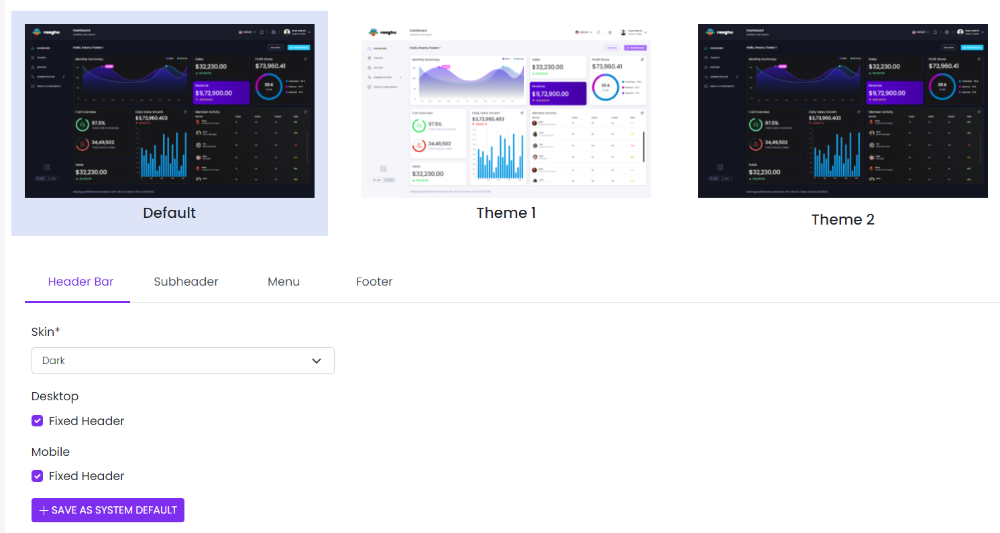

# Visual Settings

This library was generated with [Angular CLI](https://github.com/angular/angular-cli) version 13.2.0.
<p align="left">

<p/>

## ✒️ Code
```bash
<app-rds-comp-visual-settings
  [navtabItems]="navtabItems"
  [listskin]="listskin"
  [listSubmenu]="listSubmenu"
  [visualsettingsItem]="visualsettingsItem"
></app-rds-comp-visual-settings>
```

## Options
### 🏗️ Input
<!-- prettier-ignore -->
| Input Name                  | Type                             |Example| Description                                                                  |
| --------------------------- | -------------------------------- |------------| ---------------------------------------------------------------------------- |
| visualsettingsItem                | `any`  |<pre>[{ "footer": { "fixedFooter": false }, "header": { "desktopFixedHeader": true, "mobileFixedHeader": true,     "headerSkin": null, "minimizeDesktopHeaderType": null }, <br>"layout": { "layoutType": "fluid" }, "menu": { "allowAsideMinimizing": false, "asideSkin": "dark",     "defaultMinimizedAside": false, "enableSecondary": false, <br>"fixedAside": false, "hoverableAside": false, "position": "tab", "searchActive": false, "submenuToggle": null    }, <br>"subHeader": { "containerStyle": "subheader py-2 py-lg-4  subheader-transparent", "fixedSubHeader": false, "subheaderSize": 5, "subheaderStyle": null, <br>"titleStlye": "text-dark font-weight-bold my-2 mr-5" }, "theme": "theme1" }, { "footer": { "fixedFooter": false }, "header": { "desktopFixedHeader": true,<br>"mobileFixedHeader": true, "headerSkin": null, "minimizeDesktopHeaderType": null }, "layout": { "layoutType": "fluid" }, "menu": { "allowAsideMinimizing": false,<br>"asideSkin": "dark", "defaultMinimizedAside": false, "enableSecondary": false, "fixedAside": false, "hoverableAside": false, "position": "tab", "searchActive": false,<br> "submenuToggle": null }, "subHeader": { "containerStyle": "subheader py-2 py-lg-4  subheader-transparent", "fixedSubHeader": false, "subheaderSize": 5,     <br>"subheaderStyle": null, "titleStlye": "text-dark font-weight-bold my-2 mr-5" }, "theme": "theme2" },{ "footer": { "fixedFooter": true }, "header": {     <br>"desktopFixedHeader": true, "mobileFixedHeader": true, "headerSkin": null, "minimizeDesktopHeaderType": null }, "layout": { "layoutType": "fluid" }, "menu": {<br>"allowAsideMinimizing": false, "asideSkin": "dark", "defaultMinimizedAside": false, "enableSecondary": false, "fixedAside": false, "hoverableAside": false,<br>"position": "tab", "searchActive": false, "submenuToggle": null }, "subHeader": { "containerStyle": "subheader py-2 py-lg-4  subheader-transparent",<br>"fixedSubHeader": false, "subheaderSize": 5, "subheaderStyle": null, "titleStlye": "text-dark font-weight-bold my-2 mr-5" }, "theme": "default" }]</pre>|Specify the vual settings data  |
| navtabItems       | `any`  |<pre>[{ "label": "Header Bar", "tablink": "#nav-headerbar", "ariacontrols": "nav-headerbar" },<br>{ "label": "Subheader",   "tablink": "#nav-subheader", "ariacontrols": "nav-subheader" }, <br>{ "label": "Menu", "tablink": "#nav-Menu", "ariacontrols": "nav-Menu" }, <br>{ "label": "Footer",    "tablink": "#nav-footer", "ariacontrols": "nav-footer" }]</pre>|Specify the nav tab items |
| listskin    | `any`  |<pre>[{ "value": "dark", "displayText": "Dark" }, { "value": "light", "displayText": "Light" }]</pre>|Specify the nav tab itemsskin types |
| listSubmenu     | `any`  |<pre>[{ "value": "false", "displayText": "Accordian" }, { "value": "true", "displayText": "Dropdown" }]</pre>|Specify the submenu type |
