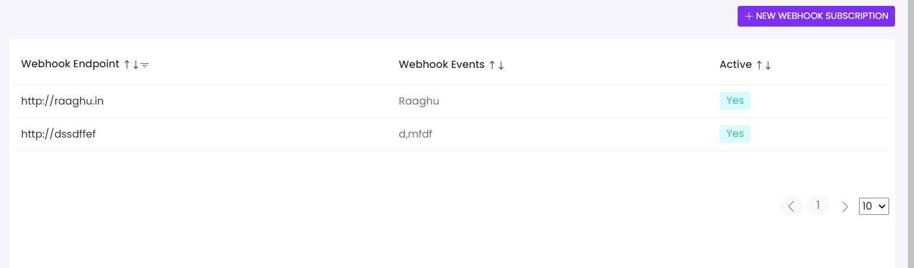

# WebHook Subscription
This library was generated with [Angular CLI](https://github.com/angular/angular-cli) version 13.2.0.
<p align="left">

<p/>

## ✒️ Code
```bash
<app-rds-comp-webhook-subscription
  [webhookTableHeader]="webhookTableHeader"
  [webhookTableData]="webhookTableData"
></app-rds-comp-webhook-subscription>
```

## Options
### 🏗️ Input
<!-- prettier-ignore -->
| Input Name                  | Type                             |Example| Description                                                                  |
| --------------------------- | -------------------------------- |------------| ---------------------------------------------------------------------------- |
| webhookTableHeader          | `[]`  |<pre>[ { displayName: 'Webhook Endpoint', key: 'WebhookEndpoint', dataType: 'text', dataLength: 30, sortable: true, required: true,filterable:true }, <br>{ displayName: 'Webhook Events', key: 'webhooksEvent', dataType: 'html', dataLength: 30, required: true, sortable: true },<br>{ displayName: 'Active', key: 'statusTemplate', dataType: 'html', dataLength: 30, required: true, sortable: true }]</pre>   |Specify the webhook Table Header 
| webhookTableData                | `[]`   |<pre>[{id: "3c71a838-af27-4924-b74f-dbeaa7a6fd63", isActive: true, webhookUri: "http://raaghu.io"},{id: "4771a838-af27-5124-b74f-dbeaa7a6fd63", isActive: true, webhookUri: "http://wai.in"}]</pre>   |Specify the webhook table data
|listItems   |`[]`|<pre>[ { value: 'New Webhook Subscription', some: 'value', key: 'newwebhook', icon: 'plus', iconWidth: '20px', iconHeight: '20px' }]</pre>|Specify the menu list for mobile view

### 💻 Output
| Output Name                 | Type          | Description                     |      
| --------------------------- | --------------|------------------|
| onSubcriptionSave                 |  `EventEmitter`  | `Emits the webhook subscription data for save`
