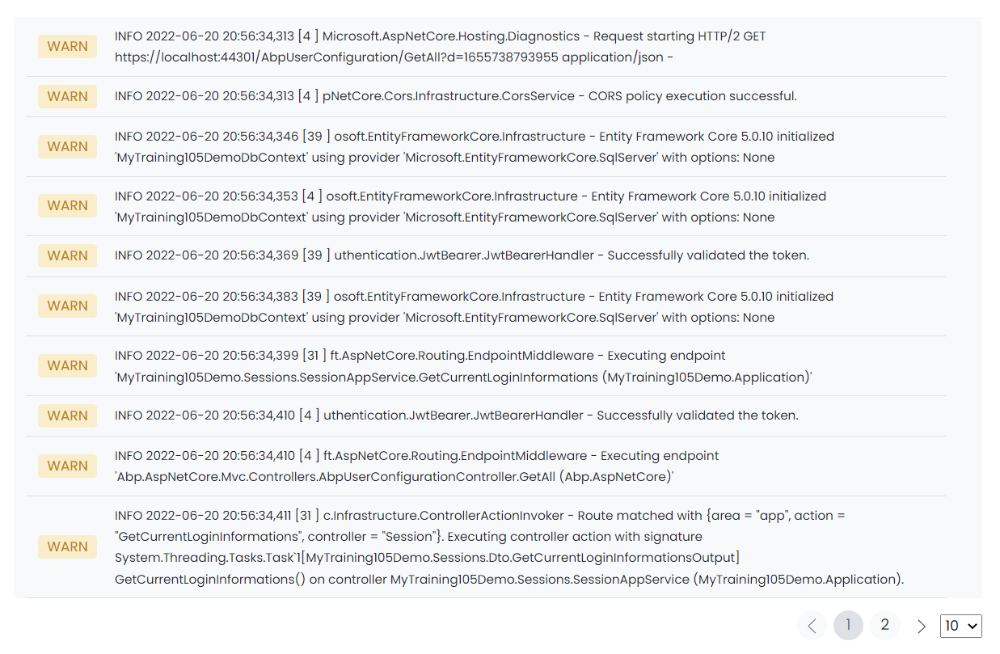

# Website Log

This library was generated with [Angular CLI](https://github.com/angular/angular-cli) version 13.2.0.
<p align="left">

<p/>

## ✒️ Code
```bash
<app-rds-comp-website-log
  [websiteLogData]="websiteLogData"
  role="Advanced"
  alignmentType="end"
  [resetPagination]="false"
  [recordsPerPage]="10"
></app-rds-comp-website-log>
```

## Options
### 🏗️ Input
<!-- prettier-ignore -->
| Input Name                  | Type                             |Example| Description                                                                  |
| --------------------------- | -------------------------------- |------------| ---------------------------------------------------------------------------- |
| role                     | `string`         |"Advanced"|Specify the type of pagination  |                             |
| alignmentType            | `string`          | "end"|Specify alignement of pagination  |
| resetPagination                   |  `boolean`                         | "false"|Specify reseting pagination required or not |
| recordsPerPage                    | `number` |     "10"|Specify number of records per page              |
| websiteLogData               | `any`  |<pre>[ INFO  2022-06-20 20:56:34,313 [4    ] pNetCore.Cors.Infrastructure.CorsService - CORS policy execution successful.,INFO  2022-06-20 20:56:34,346 [39] osoft.EntityFrameworkCore.Infrastructure - Entity Framework Core 5.0.10 initialized 'MyTraining105DemoDbContext' using provider <br>'Microsoft.EntityFrameworkCore.SqlServer' with options: None,  INFO  2022-06-20 20:56:34,353 [4    ] osoft.EntityFrameworkCore.Infrastructure - Entity Framework <br>Core 5.0.10 initialized 'MyTraining105DemoDbContext' using provider 'Microsoft.EntityFrameworkCore.SqlServer' with options: None,  INFO  2022-06-20 20:56:34,369 <br>[39   ] uthentication.JwtBearer.JwtBearerHandler - Successfully validated the token.,  INFO  2022-06-20 20:56:34,383 [39   ]<br>Microsoft.EntityFrameworkCore.Infrastructure - Entity Framework Core 5.0.10 initialized 'MyTraining105DemoDbContext' using provider <br>'Microsoft.EntityFrameworkCore.SqlServer' with options: None,  INFO  2022-06-20 20:56:34,399 [31   ] ft.AspNetCore.Routing.EndpointMiddleware-Executing endpoint <br>'MyTraining105Demo.Sessions.SessionAppService.GetCurrentLoginInformations (MyTraining105Demo.Application)',  NFO  2022-06-20 20:56:34,410 [4    ] <br>Authentication.JwtBearer.JwtBearerHandler - Successfully validated the token.,  INFO  2022-06-20 20:56:34,410 [4    ] ft.AspNetCore.Routing.EndpointMiddleware - <br><br>Executing endpoint 'Abp.AspNetCore.Mvc.Controllers.AbpUserConfigurationController.GetAll (Abp.AspNetCore)'",  "INFO  2022-06-20 20:56:34,411 [31   ] <br>c.Infrastructure.ControllerActionInvoker - Route matched with {area = \app\, action = \GetCurrentLoginInformations\, controller = \Session\}. Executing controller <br>action with signature System.Threading.Tasks.Task1[MyTraining105Demo.Sessions.Dto.GetCurrentLoginInformationsOutput] GetCurrentLoginInformations() on controller <br>MyTraining105Demo.Sessions.SessionAppService (MyTraining105Demo.Application).,  INFO  2022-06-20 20:56:34,414 [4    ] c.Infrastructure.ControllerActionInvoker - <br>Route matched with {action = \"GetAll\", controller = \"AbpUserConfiguration\", area = \"\"}. Executing controller action with signature <br>System.Threading.Tasks.Task1[Microsoft.AspNetCore.Mvc.JsonResult] GetAll() on controller Abp.AspNetCore.Mvc.Controllers.AbpUserConfigurationController <br>(Abp.AspNetCore).",  "INFO  2022-06-20 20:56:34,419 [31   ] osoft.EntityFrameworkCore.Infrastructure - Entity Framework Core 5.0.10 initialized <br>'MyTraining105DemoDbContext' using provider 'Microsoft.EntityFrameworkCore.SqlServer' with options: None",  "INFO  2022-06-20 20:56:34,419 [4    ] <br>Microsoft.EntityFrameworkCore.Infrastructure - Entity Framework Core 5.0.10 initialized 'MyTraining105DemoDbContext' using provider <br>'Microsoft.EntityFrameworkCore.SqlServer' with options: None"]</pre> |Specify the web site log data  |
